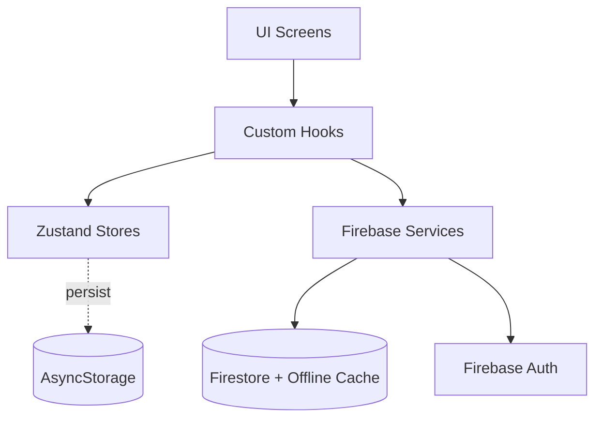

# MyFitCraft

> **Vücudunu işle. Formunu yarat.** — *Craft your body. Master your form.*

Strength training odaklı, sade ve hızlı bir mobil fitness uygulaması.
**React Native (Expo) + Firebase**, hem Android hem iOS.

## Faz Durumu

- [x] **Faz 0** — Temel kurulum (Expo + Firebase + Navigation + Theme + i18n + Zustand)
- [x] **Faz 1** — Auth (Email + Forgot Password) + Onboarding (intro + hedef + seviye + boy/kilo)
- [x] **Faz 2** — Egzersiz Kütüphanesi (33+ hareket, arama, kas grubu filtre, detay)
- [x] **Faz 3** — Programlar (4 preset + kullanıcı program builder)
- [x] **Faz 4** — Workout Tracker (set logging, dinlenme sayacı, haptic, summary, PR detection)
- [x] **Faz 5** — Vücut Ölçüleri (form + tarihçe + grafik)
- [x] **Faz 6** — Raporlar (haftalık/aylık/all + volume grafiği + PR listesi)
- [x] **Faz 7** — Profil + Gamification (streak, 8 achievement)
- [x] **Faz 8** — Polish + Test (21 unit test) + Store hazırlığı

## Özellikler

### Çalışan Özellikler
- Email/şifre ile auth + şifre sıfırlama
- 4 adımlı onboarding (intro → hedef → seviye → vücut)
- 33+ hareket içeren egzersiz kütüphanesi (TR/EN bilingual, kas grubu + ekipman filtresi)
- 4 preset program: Beginner Full Body, Push/Pull/Legs, Upper/Lower 4-Day, Cut Maintenance
- Kendi programını oluşturma (gün + egzersiz seçimi)
- Aktif workout ekranı: set/kg/rep tablosu, "geçen sefer" karşılaştırma, dinlenme sayacı, haptic feedback, keep-awake
- Workout summary: toplam volume, set sayısı, egzersiz bazlı özet
- Vücut ölçüleri: kilo, göğüs, bel, kol, bacak, boyun, yağ%
- Raporlar: haftalık/aylık/all filtreli volume grafikleri, PR (estimated 1RM) listesi
- Streak takibi (gün gün) + 8 achievement
- Light/Dark/Sistem tema, TR/EN dil değişimi
- Firestore offline persistence (otomatik)
- Aktif workout state'i AsyncStorage'a persist (uygulama kapansa bile devam eder)

### Sonraya Bırakılan
- Google + Apple Sign-In (native build gerektirir)
- Push notification (FCM)
- Premium/Subscription (RevenueCat)
- AI program önerisi
- Beslenme + kardio + Health Connect

## Teknoloji Yığını

| Katman | Teknoloji |
|---|---|
| Framework | React Native + Expo SDK 54, New Architecture |
| Dil | TypeScript (strict) |
| Backend | Firebase (Auth + Firestore + Storage) |
| Navigation | React Navigation v7 (Native Stack + Bottom Tabs) |
| State | Zustand + AsyncStorage persist |
| Form / Validation | React Hook Form + Zod |
| i18n | i18next + react-i18next (TR varsayılan, EN hazır) |
| Animasyon | Reanimated 4 + Worklets |
| Charts | react-native-gifted-charts |
| Haptics | expo-haptics |
| Build | EAS Build |
| Test | Jest + ts-jest |

## Klasör Yapısı

```
src/
├── app/                  # Provider stack + navigation root
│   ├── App.tsx
│   ├── navigation/       # Root, Auth, Tabs
│   └── providers/        # Theme, I18n
├── features/             # Feature-first ekranlar
│   ├── auth/             # Login, Register, Forgot, Onboarding
│   ├── dashboard/
│   ├── exercises/        # Liste, Detay, Seed
│   ├── programs/         # Liste, Detay, Builder, Seed
│   ├── workout/          # ActiveWorkout (kalp), Summary
│   ├── reports/
│   ├── measurements/     # Liste, Add
│   └── profile/
├── services/             # Firebase abstraction
│   ├── firebase.ts
│   ├── auth.service.ts
│   ├── users.service.ts
│   ├── exercises.service.ts
│   ├── programs.service.ts
│   ├── workouts.service.ts
│   └── measurements.service.ts
├── stores/               # Zustand stores
│   ├── auth.store.ts
│   ├── settings.store.ts (persist)
│   ├── activeWorkout.store.ts (persist)
│   ├── exercises.store.ts
│   ├── programs.store.ts
│   ├── reports.store.ts
│   └── measurements.store.ts
├── components/
│   ├── ui/               # Button, Input, Card, Screen, Text, Chip
│   ├── exercise/         # ExerciseCard, ExerciseImage
│   ├── program/          # ProgramCard
│   ├── workout/          # SetRow, RestTimer
│   └── charts/           # WeightChart
├── hooks/
├── theme/                # Renk + spacing + typography token'ları
├── i18n/                 # tr.json, en.json
├── types/                # Domain modelleri
├── utils/                # calculations, streak, achievements, format, progressiveOverload
│   └── __tests__/        # Unit testler
└── constants/

firestore.rules           # Firebase security rules
firestore.indexes.json    # Composite index tanımları
eas.json                  # EAS build profilleri
app.config.ts             # Expo config (env entegre)
```

## Kurulum

### 1. Bağımlılıklar

```powershell
npm install
```

### 2. Firebase

1. https://console.firebase.google.com/ üzerinde proje oluştur
2. **Authentication** → Sign-in method → **Email/Password**'u aktive et
3. **Firestore Database** oluştur (Production mode)
4. Project Settings → General → "Your apps" → **Web app** ekle (`</>` ikonu)
5. Konfigürasyonu kopyala
6. Repo kökünde `.env.example` dosyasını `.env` olarak kopyala ve değerleri yapıştır:

```bash
EXPO_PUBLIC_FIREBASE_API_KEY=...
EXPO_PUBLIC_FIREBASE_AUTH_DOMAIN=...
EXPO_PUBLIC_FIREBASE_PROJECT_ID=...
EXPO_PUBLIC_FIREBASE_STORAGE_BUCKET=...
EXPO_PUBLIC_FIREBASE_MESSAGING_SENDER_ID=...
EXPO_PUBLIC_FIREBASE_APP_ID=...
```

### 3. Firestore Security Rules + Indexes

```powershell
# Firebase CLI yoksa once:
npm install -g firebase-tools
firebase login
firebase init  # Mevcut projeyi sec, Firestore'i isaretle

# Deploy
firebase deploy --only firestore:rules,firestore:indexes
```

> Faz 0-7 boyunca uygulama Firebase olmadan da açılır (UI iskeleti çalışır), ama auth ve veri yazma için `.env` şart.

## Geliştirme

```powershell
# Dev server (Expo Go ile QR'i tara veya dev build)
npm start

# Android emulator / cihaz
npm run android

# iOS (Mac veya EAS Build)
npm run ios

# Type check
npm run typecheck

# Lint
npm run lint

# Format
npm run format

# Unit testler
npm test
```

> Reanimated 4 + Worklets kullandığımız için **Expo Go** bazı animasyonlarda sorun çıkarabilir. Tam destek için Expo Dev Build (EAS) önerilir.

## Build & Store Hazırlığı

### Android (öncelik)

```powershell
# EAS hesabi
npm install -g eas-cli
eas login
eas init

# Preview build (.apk - direkt cihaza yuklemek icin)
eas build --platform android --profile preview

# Production build (.aab - Play Store icin)
eas build --platform android --profile production

# Play Store Internal track'a otomatik gonder
eas submit --platform android --profile production
```

**Play Store gereksinimler:**
- Google Play Console hesabı ($25 tek seferlik)
- Privacy Policy URL (sağlık verileri olduğu için zorunlu)
- App icon (512×512), feature graphic (1024×500), 2-8 screenshot
- Içerik derecelendirme anketi
- Veri güvenliği bildirimi

### iOS (sonra)

```powershell
eas build --platform ios --profile production
eas submit --platform ios --profile production
```

**App Store gereksinimler:**
- Apple Developer hesabı ($99/yıl)
- App Store Connect uygulama kaydı
- Privacy Policy + Terms URL
- Apple Sign-In zorunlu (sosyal login varsa)
- Account deletion butonu zorunlu

## Mimari Notlar



- **UI** sadece hooks + stores ile konuşur
- **Services** layer Firebase'i soyutlar (test edilebilir, değiştirilebilir)
- **Stores** her feature için ayrı (auth, settings, activeWorkout, exercises, programs, reports, measurements)
- **Firestore** built-in offline persistence ile internet yokken de çalışır
- **AsyncStorage**: settings + activeWorkout persist (uygulama kapansa devam eder)
- **Path aliases**: `@/`, `@features/`, `@services/`, vb. (babel + tsconfig ikisinde de tanımlı)

## Veri Modeli

10 collection: `users`, `exercises`, `programs`, `programDays`, `programExercises`, `workouts`, `workoutLogs`, `personalRecords`, `bodyMeasurements`. İlişkiler için planı incele.

## Test

```powershell
npm test
```

Unit test kapsamı:
- `calculations.ts` — 1RM, hacim, increment, yüzde değişim
- `streak.ts` — Streak hesaplama + isStreakActive
- `progressiveOverload.ts` — Suggest next weight (increase/maintain/deload)

## Sorun Giderme

| Sorun | Çözüm |
|---|---|
| `Module 'react-native-worklets/plugin' not found` | `npx expo install react-native-worklets` |
| Firebase Auth persistence uyarısı | `getReactNativePersistence(AsyncStorage)` zaten kullanılıyor — uyarı normal |
| Expo Go'da Reanimated crash | Dev build kullan (`eas build --profile development`) |
| Tab bar ikonları kare yerine sembol | `@expo/vector-icons` Faz 0'da kullanılmadı; istersen `Ionicons` ile değiştirebilirsin |

## Sonraki Adımlar

1. Egzersiz veritabanını zenginleştir ([free-exercise-db](https://github.com/yuhonas/free-exercise-db) — 870 hareket + GIF)
2. GIF/animasyonları Firebase Storage'a yükle, `exercises.animationUrl` doldur
3. Google + Apple Sign-In entegrasyonu (`expo-auth-session` + `expo-apple-authentication`)
4. Push notification: günlük antrenman hatırlatması (FCM + scheduled)
5. RevenueCat entegrasyonu ile premium katman
6. Production seviye polish: özel app icon, splash screen, marka tutarlılığı
